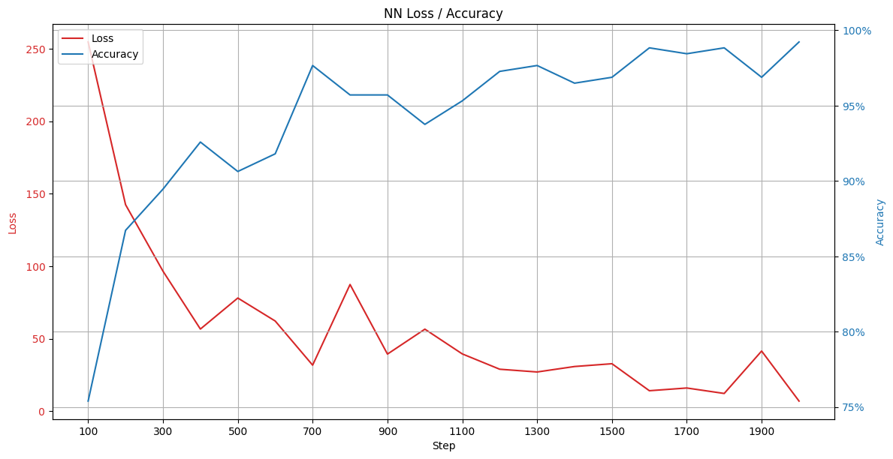
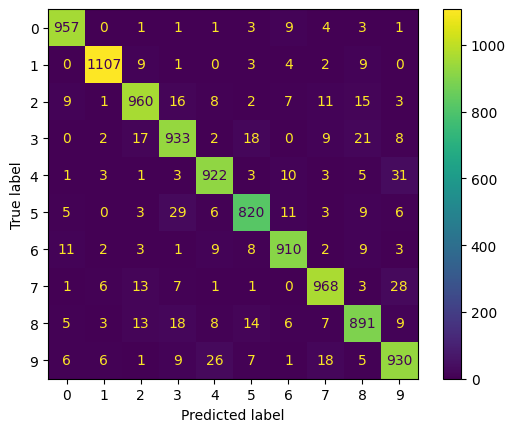
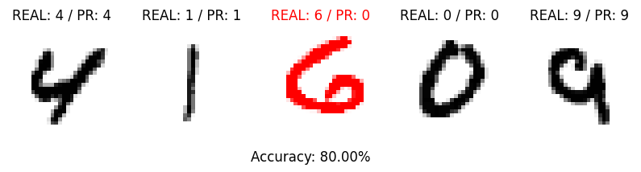

# Модуль 8. Глибоке навчання. Tensorflow.

*З циклу [домашніх завдань Python Data Science](https://github.com/lexxai/goit_python_data_sciense_homework).*

# Домашнє завдання

Завантажте в гугл колаб [цей](https://drive.google.com/file/d/10-gPf1AeEKXKOlZq9ItbKRo8gtmtNiDV/view) ноутбук. У ньому подано інструкції щодо створення нейронної мережі, що розпізнає рукописні цифри. В даному завданні від вас потрібно зробити наступне:

- Заповнити пропуски у коді.
- Навчити нейронну мережу.
- Побудувати необхідні графіки.
- Знайти втрати мережі.
- Протестувати роботу мережі на тестових даних.
- Виведіть метрики якості для кожного класу навченої моделі, використовуючи https://scikit-learn.org/stable/modules/generated/sklearn.metrics.classification_report.html
- Зробити висновки.

# Результати
Графік процесу начання

Результати навчання (classification_report)
```
               precision    recall   f1-score   support

   Number: 0       0.96      0.98      0.97       980
   Number: 1       0.98      0.98      0.98      1135
   Number: 2       0.94      0.93      0.94      1032
   Number: 3       0.92      0.92      0.92      1010
   Number: 4       0.94      0.94      0.94       982
   Number: 5       0.93      0.92      0.93       892
   Number: 6       0.95      0.95      0.95       958
   Number: 7       0.94      0.94      0.94      1028
   Number: 8       0.92      0.91      0.92       974
   Number: 9       0.91      0.92      0.92      1009

    accuracy                           0.94     10000
   macro avg       0.94      0.94      0.94     10000
weighted avg       0.94      0.94      0.94     10000
```
Результати навчання (Confuson Matrix)



Візуалізаця результатів предбачення



- [goit_python_ds_hw_08.ipynb](goit_python_ds_hw_08.ipynb)
- [Colab (goit_python_ds_hw_08.ipynb)](https://colab.research.google.com/drive/1FY4LFhix5OiKEXA_et3Zl2P7QWf3JTQk?usp=sharing)
